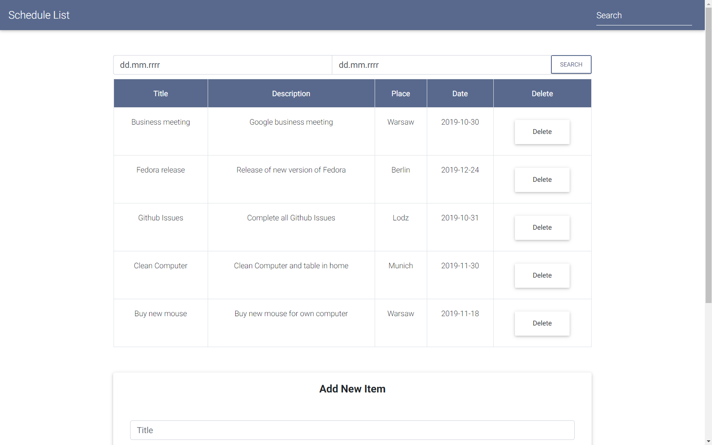
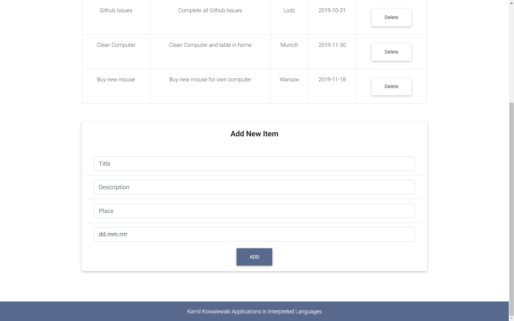
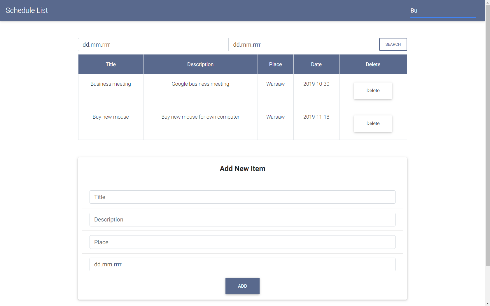
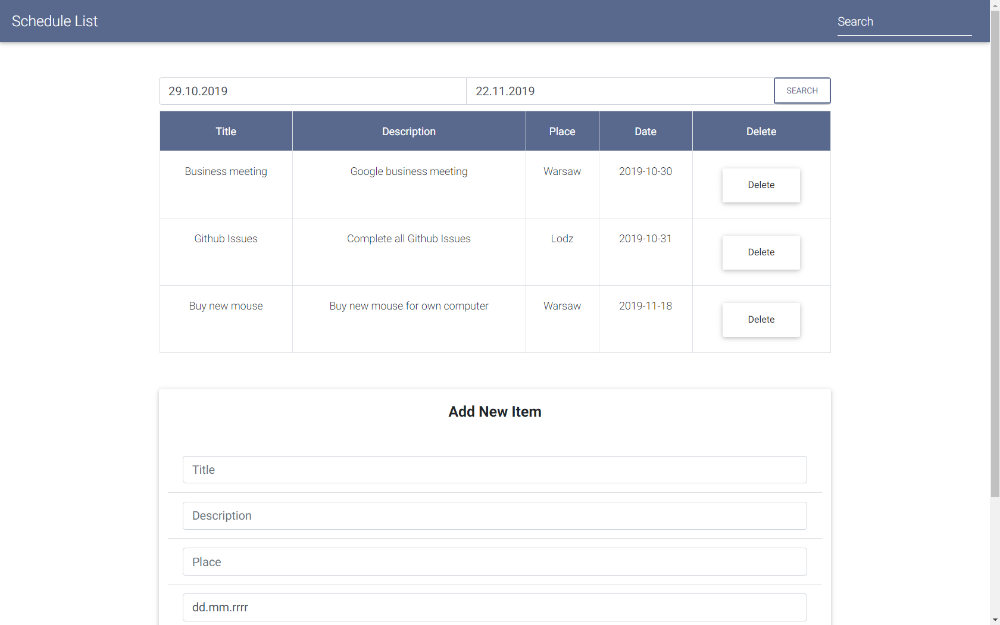
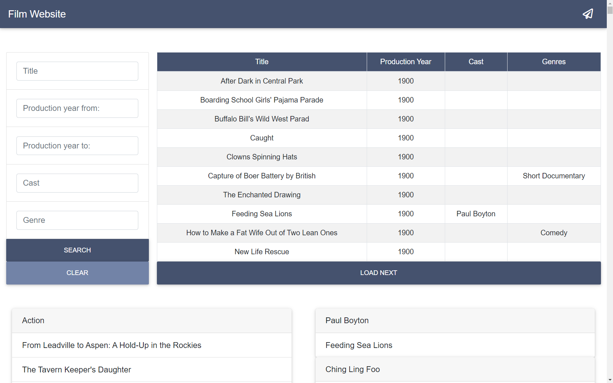
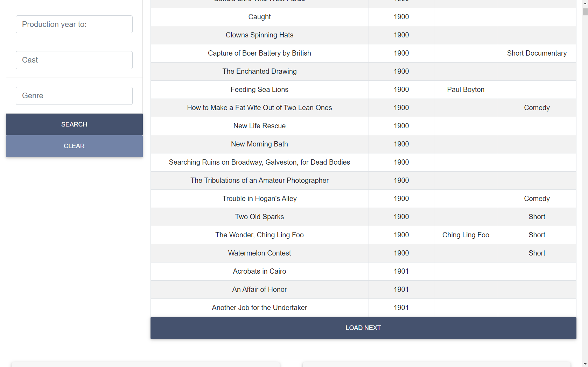
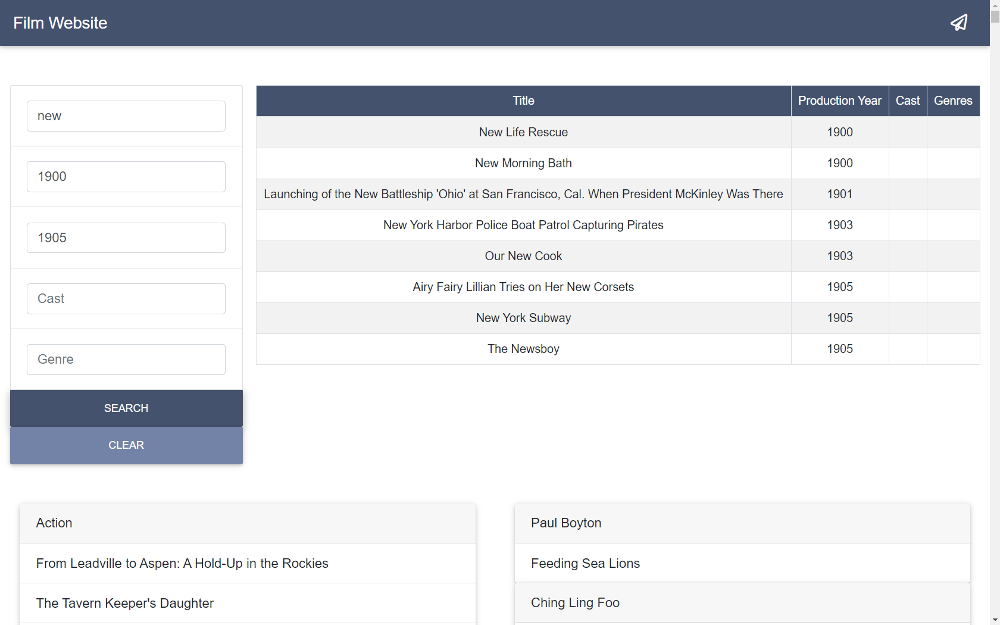
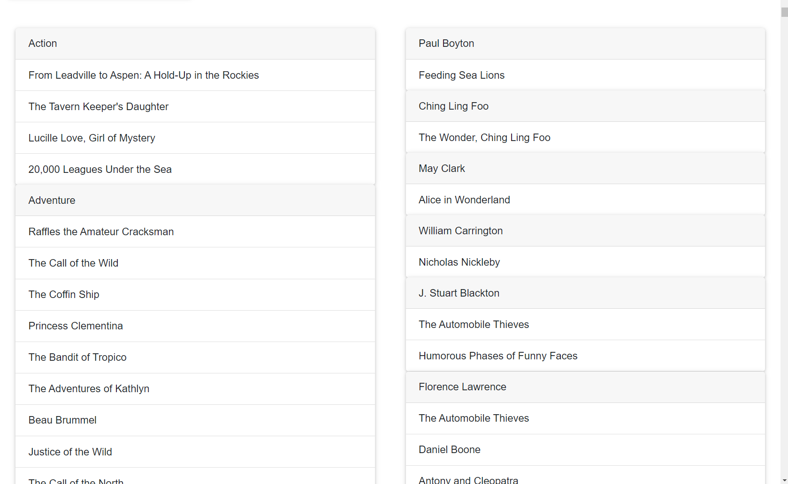

# AJI-Workshop

## Task 1 - Page with Cats
#### Simple HTML page with a gallery of cats

## Task 2 - Schedule List 
#### Schedule List created with pure JS and jQuery 
##### Generating Firebase secret key - auth
Go to project settings -> Service Accounts -> Datebase Secrets and then copy secret key.

Link to access datebase with read and write set to false -> DATEBASE_LINK + ".json" + "?auth=" + SECRET_KEY

#### Chosen screenshots
<kbd></kbd>
#### Adding new Item
<kbd></kbd>
#### Filtering by Title
<kbd></kbd>
#### Filtering by Date
<kbd></kbd>

## Task 3 - Vue Film Website
#### Chosen screenshots
<kbd></kbd>
#### Loading Button
<kbd></kbd>
#### Ability to Filter by Title, Year, Genres and so on
<kbd></kbd>
#### Displaying List of Movies based on Categories and Cast
<kbd></kbd>

## Vue Exercise
Container for sample projects from tutorials. 
Contains: Vue Store Basket, Vue Schedule List, Vue Weather Forecast. 
